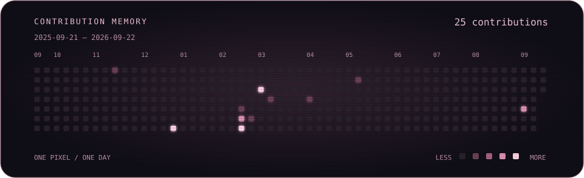

**软乎乎的猫猫，和偶尔冒出来的奇怪思想火花。**

[GitHub](https://github.com/HurtGhostMeow) · [哔哩哔哩](https://space.bilibili.com/403101742) · [X](https://x.com/HurtGhostMeow) · [Email](mailto:HurtGhostMeow1@outlook.com)

### 关于我

大湾区大学首届本科生，通信工程专业。大湾区大学机器人社团「驭浪者战队」硬件电路部部长，「能工智人」兴趣小组主要成员之一。

- 喜欢硬件电路设计和制作小玩意，正在朝芯片设计方向学习。
- 用 Vibe Coding 把脑子里的点子变成可以玩的东西。
- 正在学习板绘、贝斯，以及如何被更多猫猫包围。勉強ing…

### 正在发光的记录

每一天是一颗像素，慢慢把屏幕点亮。GitHub Actions 每日刷新；采用 GitHub 贡献日历口径，包含符合条件的提交、Issue、PR 等活动。

### 做过的小世界

| 项目 | 简介 | 入口 |
| --- | --- | --- |
| **3D 扫雷** | 大一上计科导期末个人作品，把模块化思维、比特精准与无缝衔接放进三维雷区。 | [体验](https://3dminesweeper.hgmeow.eu.org) · [源码](https://github.com/HurtGhostMeow/3D-Minesweeper) |
| **织芯 · The Fabric** | 大一下计科导期末小组作品，面向数字电路教学与协作的全栈网页游戏，包含游戏、论坛与 AI 助手。 | [体验](https://fabric.hgmeow.eu.org) |

生活就像猫，你得温柔地对待它。

